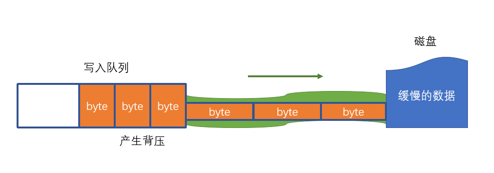

# 文件流

## 什么是流

流是指数据的流动,数据从一个地方缓缓的流动到另一个地方的
比如: 硬盘->内存,网卡->内存,硬盘->网卡等等

### 流是有方向的
可读流：Readable，数据从源头流向内存

可写流：Writable，数据从内存流向源头

双工流：Duplext，数据既可从源头流向内存，又可从内存流向源头


## 为什么需要流
1. 其他介质和内存的数据规模不一致，内存规模很小的，只能是用一部分拿一部分
2. 其他介质和内存的数据处理能力不一致，内存中很快，但是其他介质比如硬盘肯定是不及内存的

**所以需要流来一部分的缓慢的处理数据**

## 文件流

```js
const { Readable, Writable } = require("stream");
```

### 什么是文件流

内存数据和磁盘文件数据之间的流动


## 文件流的创建

### 可读流

**`fs.createReadStream(path[,options]);`**

含义：创建一个文件可读流，用于读取文件内容
path：读取的文件路径

#### option:可选配置
1. encoding: 编码格式,默认为null,也就是Buffer
2. start: 起始字节
3. end: 结束字节
4. highWaterMark: 每次读取数量(`默认64 * 1024,即64KB`)
    值为x时: 如果是utf-8,utf-8本身会将汉字当作3个字节,x在这就代表x个`汉字字符`.如果encoding为null,就表示x个字节大小(buffer格式)
5. autoClose:默认为true,表示读完后会自动关闭
6. flags:"r",r就是默认值,代表只读

#### 返回：Readable的子类ReadStream

事件：rs.on("事件名",处理函数);

有哪些事件呢？

- open:文件打开事件,**文件被打开后触发**
- error:发生错误时触发

- close: 文件被关闭后触发(如果不关,就删不掉该文件,因为被占用)
    - 可以通过rs.close手动关闭
    - 或文件读取完成后自动关闭

- data: **读取到一部分数据后就触发,取决于配置的highWaterMark**
    - `注册data事件后,才会真正开始读取,否则不读,只是出于打开状态`
    - 每次读取highWaterMark指定的数量
    - 回调函数中会附带读取到的数据
        - **若指定了编码，则读取到的数据会自动按照编码转换为`字符串`**
        -否则，读取到的数据是`Buffer`

- end: 所有数据读取完毕后触发,在close之前

**如果要得到完整的数据,还不如直接用`readFile`,就没必要用流;流是想用一部分就读一部分,它会自动扔掉读完的数据**

- 暂停读取：rs.pause(),然后会触发pause事件

- 恢复读取：rs.resume(),然后会触发resume事件


### 可写流
**`fs.createWriteStream(path[,options]);`** 

同类操作同可读流一致

#### options
1. flags:操作文件的方式("a"是追加内容,"w"是重新写入,即直接覆盖原内容)
2. encoding: 编码方式
3. start:起始字节
4. highWaterMark: **每次最多写入的`字节数`,不论编码方式,就是字节数!!**
    - 中文本身一个字是三个字节,如果我们配置2那一次就写不完需要两次才行(后面的排队)

#### 返回值

Writable的子类WriteStream

**ws.on(事件名,处理函数)**

有哪些事件呢?

1. open:
2. error:
3. close:


**ws.write(data);**
1. 写入一组数据data
2. data是字符串或Buffer
3. 会返回一个布尔值(受highWaterMark和编码格式影响)
    - true：表示写入通道没有被填满，接下来的数据可以`直接写入，无需排队`
    - false：写入通道目前已`被填满`，接下来的数据将`进入写入队列`
        - 要**特别注意`背压问题`**,因为`写入队列是 内存中的数据` ，是有限的

4. 当**写入通道排满过之后, 再清空(也就是这段数据写进了磁盘了里了)**时,会`触发drain事件`

**也就是说如果一开始通道就没排满,虽然此时通道为空,但不会触发drain**

因为内存积压 --> 背压问题,导致可能报错

`**主要还是因为磁盘处理速度慢于内存速度**`但最终肯定是会都写完的

##### 如何解决背压问题？
就是利用drain和flag

但是运行速度还是慢啊,毕竟要等磁盘...

**ws.end([data]);**

- 写入结束, 将自动关闭文件
    - 是否自动关闭取决于autoClose的配置
    - 默认为true
- **data是可选的, 表示关闭前的最后一次写入**


**传输大文件,一定要使用流!!因为内存中暂存的数据就会是轻量级**


### rs.pipe(ws)

非常强

1. **`将可读流连接到可写流`**,就是读一块写一块,产生背压停止,通道空了再恢复
2. 返回参数的值
3. 该方法可解决背压问题